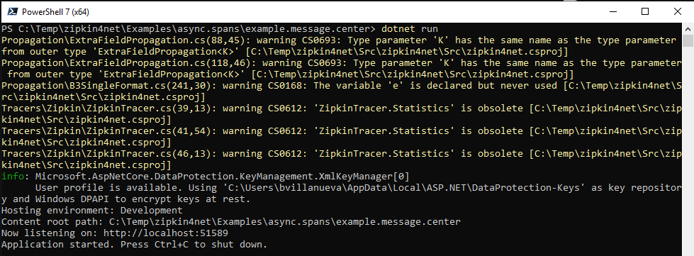

# Basic example showing async spans between PRODUCER and CONSUMER applications

This document will show how to implement PRODUCER and CONSUMER spans using zipkin4net library.

## Implementation Overview

We got 3 applications to produce example PRODUCER and CONSUMER spans.

- `example.message.center` - Stores and pops messages. The messages contain trace information.
- `example.message.producer` - Creates a message with trace information and stores it to `example.message.center`. Logs PRODUCER span to zipkin server.
- `example.message.consumer` - Fetches the message from `example.message.center`. Logs CONSUMER span to zipkin server.

## Pre-requisites

In order to build the example, you need to install:
- at least [dotnet 2.2](https://dotnet.microsoft.com/download/dotnet-core/2.2)

To run the examples, you need a live zipkin server.

## Running the example

1. Run `example.message.center` app
  - On a commandline, navigate to `Examples\async.spans\example.message.center`
  - Run `dotnet run`
  

2. Run `example.message.producer` app
  - On a commandline, navigate to `Examples\async.spans\example.message.producer`
  - Run `dotnet run <base url of live zipkin server>`
  

3. Run `example.message.consumer` app
  - On a commandline, navigate to `Examples\async.spans\example.message.consumer`
  - Run `dotnet run <base url of live zipkin server>`
  

4. Check the output
  - Go to zipkin UI
  - Search for `message.producer` or `message.consumer` as serviceName
  - Click one of the search result, it should show the PRODUCER and CONSUMER spans
  

## What to take note on how to use PRODUCER and CONSUMER spans

### PRODUCER spans

- To make a PRODUCER span, you need to use `ProducerTrace` class 
- Example code from [example.message.producer](example.message.producer/Program.cs)
```csharp
using (var messageProducerTrace = new ProducerTrace("<Application name>", "<RPC here>"))
{
    // TracedActionAsync extension method logs error annotation if exception occurs
    await messageProducerTrace.TracedActionAsync(ProduceMessage(messageProducerTrace.Trace.CurrentSpan, text));
}
```
- `TracedActionAsync` is used to run the process that is measured to log error annotation in your zipkin trace if exception is thrown.
- Make a way that trace information is passed out using your message. So in the example, the trace information is part of the message which will be parsed by the consumer application to start CONSUMER spans.

### CONSUMER spans

- To make a CONSUMER span, you need to use `ConsumerTrace` class 
- Example code from [example.message.consumer](example.message.consumer/Program.cs)
```csharp
static async Task ProcessMessage(Message message)
{
    // need to supply trace information from producer
    using (var messageProducerTrace = new ConsumerTrace(
        serviceName: "<Application name>",
        rpc:  "<RPC here>",
        encodedTraceId: message.TraceId,
        encodedSpanId: message.SpanId,
        encodedParentSpanId: message.ParentId,
        sampledStr: message.Sampled,
        flagsStr: message.Flags.ToString(CultureInfo.InvariantCulture)))
    {
        await messageProducerTrace.TracedActionAsync(Task.Delay(600)); // Test delay for mock processing
    }
}
```
- In the example PRODUCER application passed in the trace information through the `message` object. Using the trace information, CONSUMER span is created.
- `TracedActionAsync` is used to run the process that is measured to log error annotation in your zipkin trace if exception is thrown.
